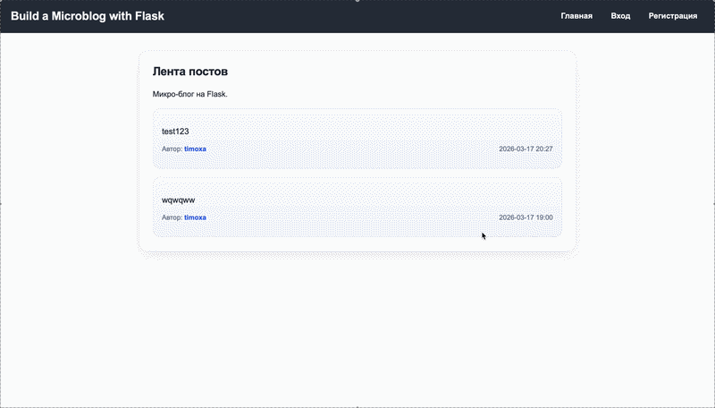

# Build a Microblog with Flask 

## :question: Описание

это веб-приложение для публикации коротких текстовых постов.  
Проект реализован в рамках практики на основе проекта из репозитория  
https://github.com/practical-tutorials/project-based-learning ***(раздел Python, Web Applications, Build a Microblog with Flask).*** 
Пользователи могут регистрироваться, входить в систему, создавать посты, редактировать и удалять их, а также просматривать профили других пользователей.

##  Функции

- Регистрация и авторизация пользователей  
- Профиль пользователя  
- Создание постов  
- Редактирование постов  
- Удаление постов  
- Лента всех постов  
- Ограничение доступа (редактирование только своих постов) 

## Архитектура

- **Backend:** Flask  
- **Database:** SQLite  
- **ORM:** SQLAlchemy  
- **Authentication:** Flask-Login  
- **Forms:** Flask-WTF  
- **Frontend:** HTML, CSS, Jinja2  
- **Deployment:** Render  

## :exclamation: Установка

1. Клонируйте репозиторий 
```bash
git clone git@github.com:1ce1ceice/BuildMicroblogWithFlask.git
cd BuildMicroblogWithFlask
```

2. Создайте виртуальное окружение
```bash
python3 -m venv venv
source venv/bin/activate
```

3. Установите зависимости
```bash
pip install -r requirements.txt
``` 

## Запуск

```bash
python3 run.py
```

## 🌍 Deployment

Live demo: https://buildmicroblogwithflask.onrender.com/

## Demo

